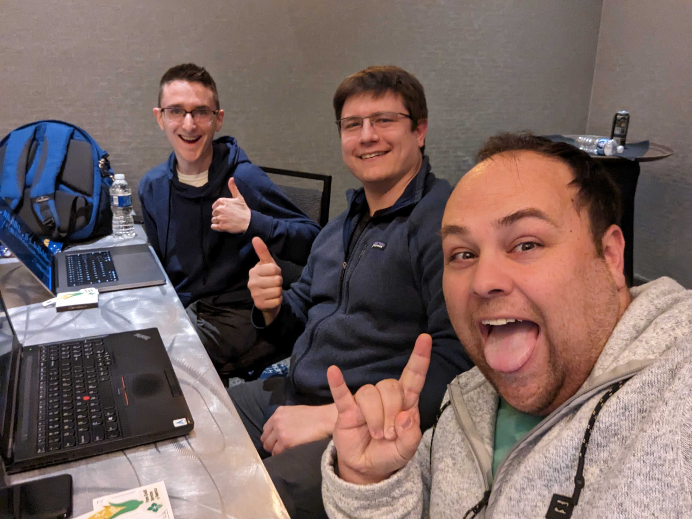

# Spicy Goats

Only the spiciest members can be a GOAT.

# Team

# Commit
We assessed commit `#9289acb`

# Notes for you/your team
## Behavior
* What does it do? (business purpose)
Ticket selling and Event Management Platform
* Who does it do this for? (internal / external customer base)
Internal and External customer base
* What kind of information will it hold?
Customer data
Ticket data
Event Data
Order Status
* What are the different types of roles?
Roles do not seem to be implemented yet, so everything seems to use a "userOwns" check: [/**](https://github.com/Attendize/Attendize/blob/9289acbab1583898fd85aeee66c7b613d8971deb/app/Attendize/Utils.php#L81-L87)
* What aspects concern your client/customer/staff the most?
## Tech Stack
* Framework & Language - Rails/Ruby, Django/Python, mux/Golang
PHP ^7.3
Laravel 6.x
* 3rd party components, Examples:
  - omnipay
  - dompdf
  - wkhtml2pdf (Attendize uses Wkhtml2PDF to generate tickets)
  - maatwebsite/excel
  
* Datastore - Postgresql, MySQL, Memcache, Redis, Mongodb, etc.
  - MySQL 5.7.23
  >They’re seeding the database from this file - https://github.com/Attendize/Attendize/blob/develop/database/seeds/countries.json
  
## Brainstorming / Risks
* Here is what the feature or product is supposed to do... what might go wrong?
* Okay - based on the tech stack, I've realized that the:
  * ORM - Does SQLi in _this_ way
  * Template language introduces XSS in _this_ way
- [min 8 characters in passwords](https://github.com/Attendize/Attendize/blob/develop/app/Http/Controllers/UserSignupController.php#L57)
## Checklist of things to review
### Risks
- [ ] Look for instances of `{!! $thing !!}` in the template/views (there is tons of this)
- [ ] Look for OS commands
### Authentication
- [ ] Login page give error messages, check for enumeration
- [ ] Signup page allows for freeform passwords, does it implement proper password complexity?
- [ ] [Custom Captcha](https://github.com/Attendize/Attendize/blob/develop/app/Services/Captcha/Factory.php)
- [ ] [UserLoginController](https://github.com/Attendize/Attendize/blob/develop/app/Http/Controllers/UserLoginController.php)
### Authorization
- [X] CSRF disabled anywhere?
- [X] No auth
- [ ] Likely able to cancel anyone's attendance using event_id and attendee_id. [Route](https://github.com/Attendize/Attendize/blob/9289acbab1583898fd85aeee66c7b613d8971deb/routes/web.php#L452-L454) and [function](https://github.com/Attendize/Attendize/blob/9289acbab1583898fd85aeee66c7b613d8971deb/app/Http/Controllers/EventAttendeesController.php#L569) 
### Auditing/Logging
- [X] There is essentially no logging here (besides console logging)
### Injection
- [ ] Search for `system` `shell_exec` `exec`
> You can escape `[CONCAT_WS]`(https://github.com/Attendize/Attendize/blob/undefined/app/Http/Controllers/EventCheckInController.php#L62) with a single ' (attendee first name)
### Cryptography
- [X] Using Laravel's Hash facade which provides secure Bcrypt and Argon2 hashing for user passwords
### Configuration
- [ ] Look for any "Laravel Gotchas"
- [ ] Hardcoded values
- [ ] Debug turned on?
>APP_DEBUG=true in the example env file

- [server.php](https://github.com/Attendize/Attendize/blob/develop/server.php)
- [nginx.conf](https://github.com/Attendize/Attendize/blob/develop/nginx.conf)
- [app.php](https://github.com/Attendize/Attendize/blob/develop/config/app.php)
- [auth.php](https://github.com/Attendize/Attendize/blob/develop/config/auth.php)
## Mapping / Routes
- [Web](https://github.com/Attendize/Attendize/blob/develop/routes/web.php)
- [API](https://github.com/Attendize/Attendize/blob/develop/routes/api.php)
## Mapping / Authorization Decorators
No auth decorators
## Mapping / Files

Collap
